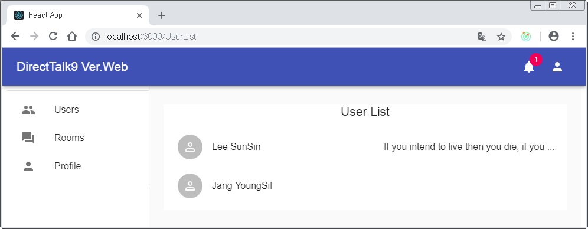
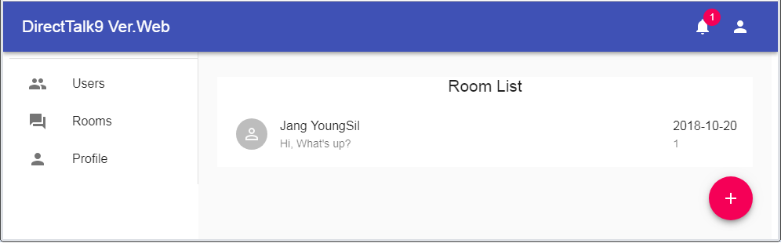
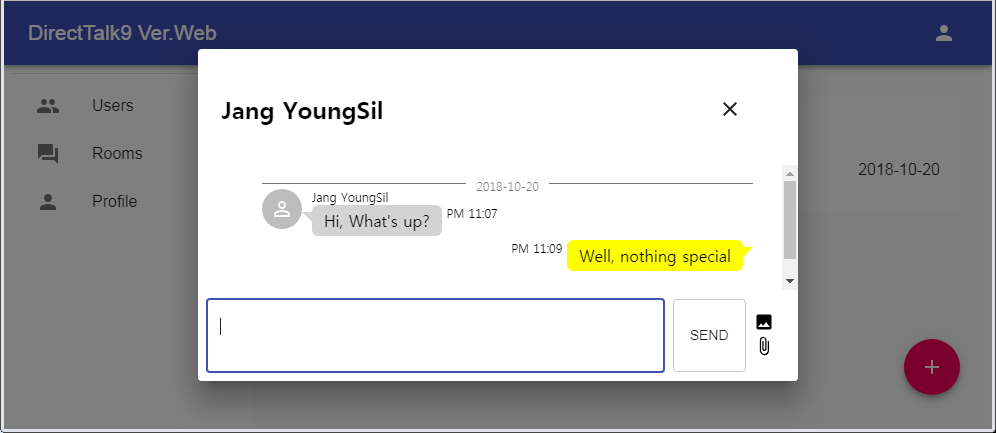

# DirectTalk9 #

This is a messenger app for Web(React) based on Firebase (Cloud Firestore) for live chat.

This app is suitable for enterprise messenger where all users appears because there is no management function such as add / delete / find friends.

### Other Versions ###

- [Android](https://github.com/gujc71/DirectTalk9)
- Web: this
- PC (Windows): To be developed

### Issues ###
- The serverTimestamp is required to store the message send time, while the serverTimestamp requires firebase-admin. This SW was created without firebase-admin, so the Javascript Date class was used instead of serverTimestamp. Therefore, there may be a problem when using it with the Android version. If you use both versions together, install firebase-admin.

- When saving a file to Firebase Storage, save the file with a different name. When downloading, it is converted to the original file name. The Android version of Firebase provides this functionality, but it is not available on the web. Therefore, this SW which is a Web version downloads it with a strange file name.

### Install & Run ###

- git clone https://github.com/gujc71/DirectTalk9_web.git
- npm install
- set config for [firebase](https://firebase.google.com/docs/web/setup?authuser=0) in Firestore.js 
- enable services(Auth, Storage, Firestore) in the firebase console.
- npm start

### License ###
GPL v3
